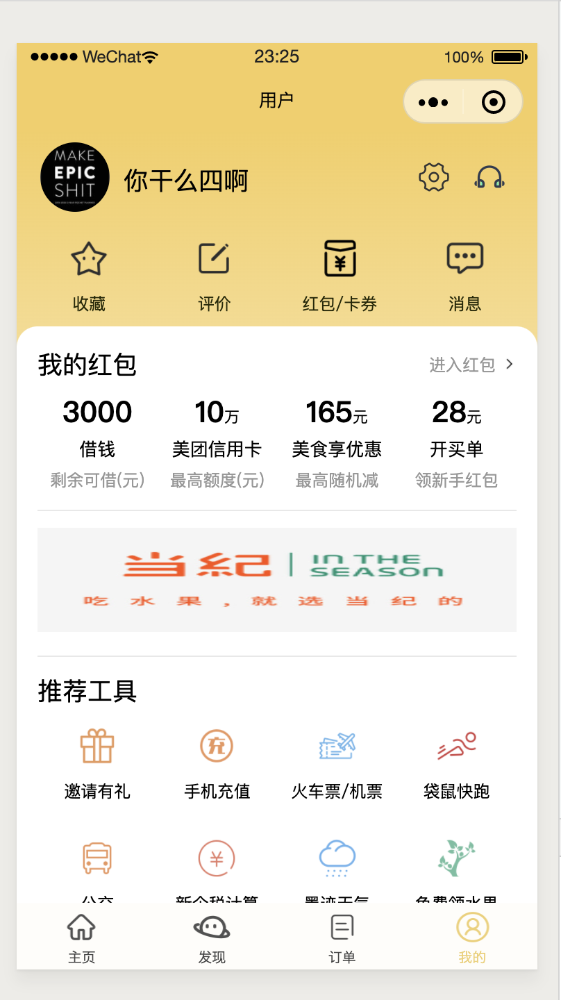

# meituan
仿美团小程序

##### 首页页面截图

##### 发现页面截图

##### 订单页面截图

##### 用户页面截图

###### 该项目为小程序练手使用，数据均前端写死，图片包含在项目文件中，因而超过小程序项目编译大小，小程序最大可编译8M项目，且需要分包加载。

###### 项目代码可将图片上传网络，通过网络地址引用，或者存储在数据库，通过接口调用，从而实现开发程序可编译进行预览。